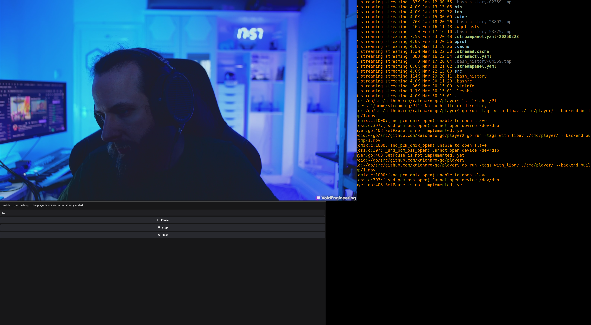

# `player`

[](http://creativecommons.org/publicdomain/zero/1.0/)

This is a package that allows to play media files/stream in Go. See demo in [`./cmd/player`](./cmd/player/).

A minimal example to play a media file/stream would be:
```go
    m := player.NewManager(types.OptionPathToMPV(*mpvPath))
    p, err := m.NewPlayer(ctx, "player demonstration", player.BackendBuiltinLibAV) // available values: player.BackendLibVLC, player.BackendMPV, player.BackendBuiltinLibAV
    if err != nil {
        return fmt.Errorf("unable to open a media player: %w", err)
    }

    err = p.OpenURL(ctx, mediaPath)
    if err != nil {
        return fmt.Errorf("unable to open the url '%s': %v", mediaPath, err)
    }
```

* To have the support of `BackendLibVLC` one must build with tag `with_libvlc`.
* To have the support of `BackendBuiltinLibAV` one must build with tag `with_libav`.

An example how to run the demo:
```sh
go run -tags with_libvlc ./cmd/player/ --backend libvlc MY_MEDIA_FILE_HERE
```

Or:
```sh
go run -tags with_libav ./cmd/player/ --backend builtin_libav MY_MEDIA_FILE_HERE
```

Expected result:


# Installing dependencies

## Ubuntu

```sh
# fyne
sudo apt install -y libgl-dev libx11-dev libxrandr-dev libxcursor-dev libxinerama-dev libxi-dev libxxf86vm-dev

# audio
sudo apt install -y libasound2-dev

# libav
sudo apt install -y libavcodec-dev libavdevice-dev

# libvlc
sudo apt install -y libvlc-dev

# mpv
sudo apt install -y mpv
```


## Fedora

```sh
# fyne
sudo dnf install -y libglvnd-devel libX11-devel libXrandr-devel libXcursor-devel libXinerama-devel libXi-devel libXxf86vm-devel

# audio
sudo dnf install -y alsa-lib-devel

# libav
sudo dnf install -y libavcodec-free-devel libavdevice-free-devel libavfilter-free-devel libavformat-free-devel libavutil-free-devel

# libvlc
sudo dnf install -y vlc-devel

# mpv
sudo dnf install -y mpv
```
